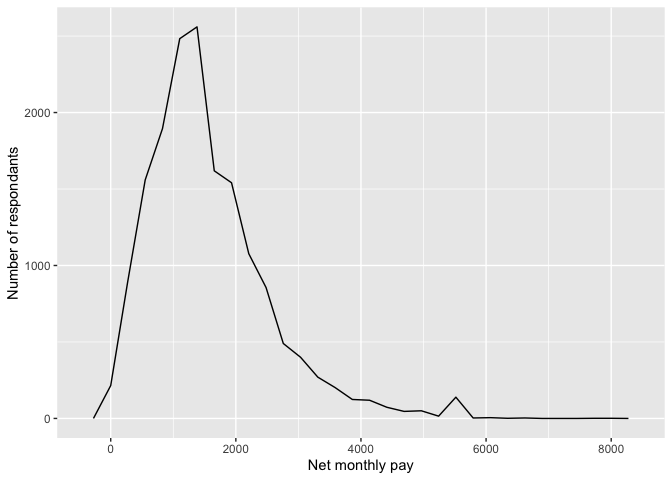
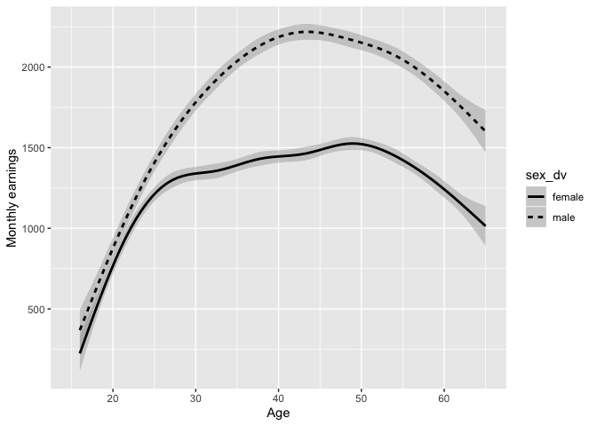
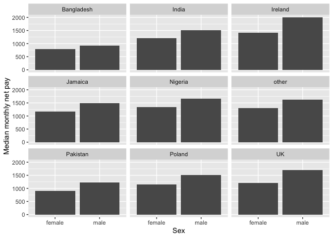
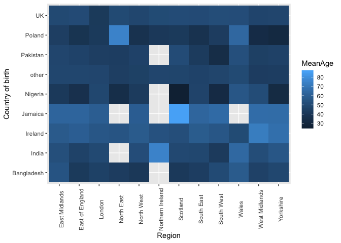
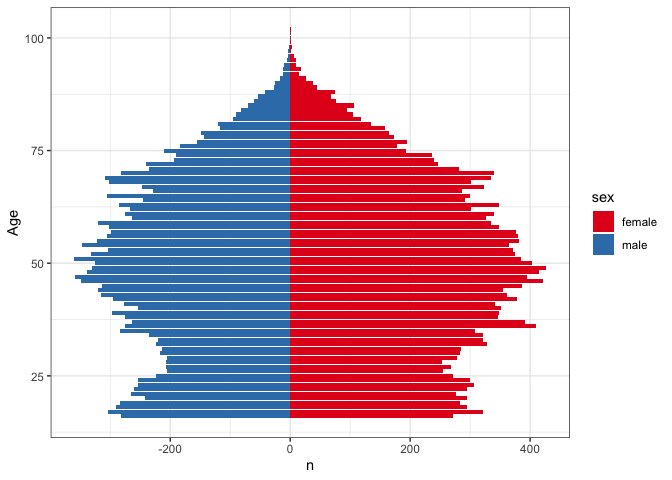

Statistical assignment 4
================
Alhoussein Nasser Candidate number: 142905
26/2/2020

In this assignment you will need to reproduce 5 ggplot graphs. I supply graphs as images; you need to write the ggplot2 code to reproduce them and knit and submit a Markdown document with the reproduced graphs (as well as your .Rmd file).

First we will need to open and recode the data. I supply the code for this; you only need to change the file paths.

    ```r
    library(tidyverse)
    Data8 <- read_tsv("/Users/alhousseinnasser/Downloads/UKDA-6614-tab 2/tab/ukhls_w8/h_indresp.tab")
    Data8 <- Data8 %>%
        select(pidp, h_age_dv, h_payn_dv, h_gor_dv)
    Stable <- read_tsv("/Users/alhousseinnasser/Downloads/UKDA-6614-tab 2/tab/ukhls_wx/xwavedat.tab")
    Stable <- Stable %>%
        select(pidp, sex_dv, ukborn, plbornc)
    Data <- Data8 %>% left_join(Stable, "pidp")
    rm(Data8, Stable)
    Data <- Data %>%
        mutate(sex_dv = ifelse(sex_dv == 1, "male",
                           ifelse(sex_dv == 2, "female", NA))) %>%
        mutate(h_payn_dv = ifelse(h_payn_dv < 0, NA, h_payn_dv)) %>%
        mutate(h_gor_dv = recode(h_gor_dv,
                         `-9` = NA_character_,
                         `1` = "North East",
                         `2` = "North West",
                         `3` = "Yorkshire",
                         `4` = "East Midlands",
                         `5` = "West Midlands",
                         `6` = "East of England",
                         `7` = "London",
                         `8` = "South East",
                         `9` = "South West",
                         `10` = "Wales",
                         `11` = "Scotland",
                         `12` = "Northern Ireland")) %>%
        mutate(placeBorn = case_when(
                ukborn  == -9 ~ NA_character_,
                ukborn < 5 ~ "UK",
                plbornc == 5 ~ "Ireland",
                plbornc == 18 ~ "India",
                plbornc == 19 ~ "Pakistan",
                plbornc == 20 ~ "Bangladesh",
                plbornc == 10 ~ "Poland",
                plbornc == 27 ~ "Jamaica",
                plbornc == 24 ~ "Nigeria",
                TRUE ~ "other")
        )
    ```

Reproduce the following graphs as close as you can. For each graph, write two sentences (not more!) describing its main message.

1.  Univariate distribution (20 points).

    ``` r
    ggplot(Data,
       aes(x = h_payn_dv)) +
      geom_freqpoly()   +
      xlab("Net monthly pay") +
      ylab("Number of respondants")
    ```

     The majority of people make less than 2000 pounds a month. There is a notable amount of people who make between 5000 and 6000 pounds a month.

2.  Line chart (20 points). The lines show the non-parametric association between age and monthly earnings for men and women.

    ``` r
    bySex <- Data %>%
      filter(!is.na(sex_dv)) %>%
      group_by(h_age_dv, sex_dv) 


      bySex %>%   ggplot(aes(x = h_age_dv, y = h_payn_dv, linetype = sex_dv)) +
        geom_smooth(color = "black") +
        xlim(15,65) +
        xlab("Age") +
        ylab("Monthly earnings")
    ```

     Men usually make more money than women. Men usually make the most amount of money during their early forties while women make the most during their late forties.

3.  Faceted bar chart (20 points).

    ``` r
     medianMp <- Data %>%
       filter(!is.na(placeBorn) & !is.na(h_payn_dv) & !is.na(sex_dv)) %>%
       group_by(placeBorn, sex_dv) %>%
      summarise( medianIncome = median(h_payn_dv, na.rm = TRUE))


       medianMp %>%
      ggplot(aes(x = sex_dv, y = medianIncome)) +
      geom_bar(stat = "identity") +
      xlab("Sex") +
      ylab("Median monthly net pay") +
      ylim(0,2000) +
      facet_wrap(~ placeBorn) 
    ```

     The male median is always greater regardless of the country of birth. Males born in Ireland and females born in the UK have the highest medians.

4.  Heat map (20 points).

    ``` r
    meanAge <- Data %>%
       filter(!is.na(placeBorn) & !is.na(h_gor_dv) & !is.na(h_age_dv)) %>%
       group_by(placeBorn, h_gor_dv) %>%
      summarise( MeanAge = mean(h_age_dv, na.rm = TRUE))

      meanAge %>% 
      ggplot(aes(x = h_gor_dv, y = placeBorn, fill = MeanAge)) +
      geom_tile()+
      xlab("Region") +
      ylab("Country of birth") + 
      theme(axis.text.x = element_text(angle = 90))
    ```

     Squares lacking colour mean that there is no data available. Wales seems to be the region where the all of the age means are relatively high when compared to other regions.

5.  Population pyramid (20 points).

    ``` r
    AgeSex <- Data %>% 
      filter(!is.na(h_age_dv) & !is.na(sex_dv)) %>% 
      group_by(h_age_dv, sex_dv) %>%
     count(h_age_dv) %>%
      mutate(n = if_else(sex_dv == "male", -n, n)) %>%
      rename(sex = sex_dv)


     AgeSex %>% 
    ggplot(aes(x = h_age_dv, y = n, fill = sex)) + 
       geom_bar(data = subset(AgeSex, sex == "female"), stat = "identity") + 
       geom_bar(data = subset(AgeSex, sex == "male"), stat = "identity")  + 
       xlab("Age") +
       coord_flip() + 
       scale_fill_brewer(palette = "Set1") +
       theme_bw()
    ```

     There are slightly more female respondents than male respondents across all ages. The highest number of males responding is around 350 per age between the ages of 50 and 55 while the highest for women is around 420 per age between the ages of 47 and 51.
